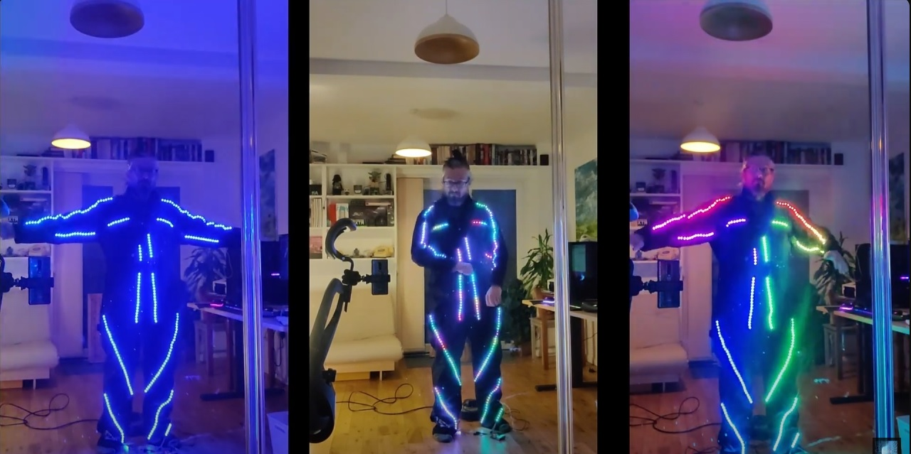

# LED Dance Suit

Requires the Neopixel Library 

* sudo pip3 install rpi_ws281x adafruit-circuitpython-neopixel
* sudo python3 -m pip install --force-reinstall adafruit-blinka

More details from: https://learn.adafruit.com/neopixels-on-raspberry-pi/python-usage

[Project Website](https://www.tecoed.co.uk/led-dance-suit.html)

[YouTube Video how it was built](https://www.youtube.com/watch?v=L4mjdx66rnI)

[YouTube Video what it does](https://www.youtube.com/watch?v=bSzGzkBkrfA)